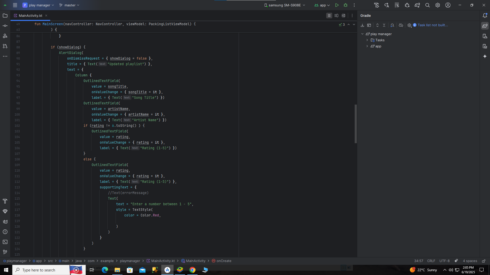
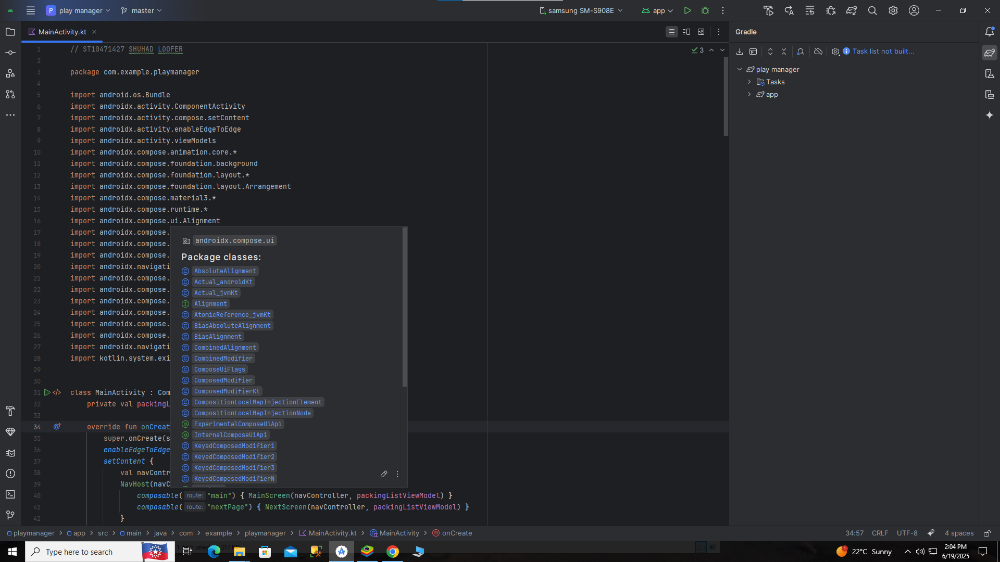
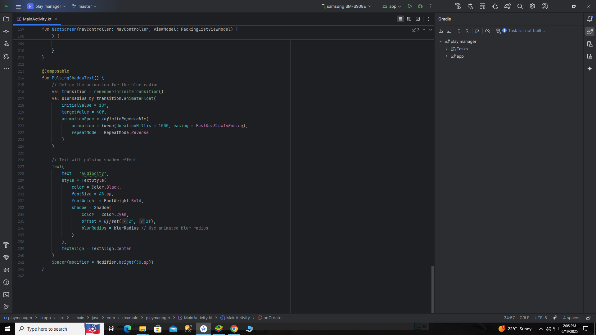
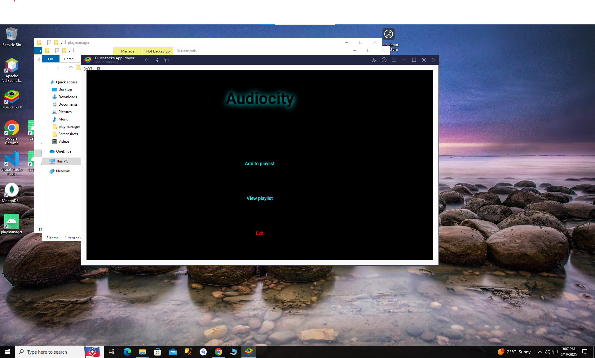
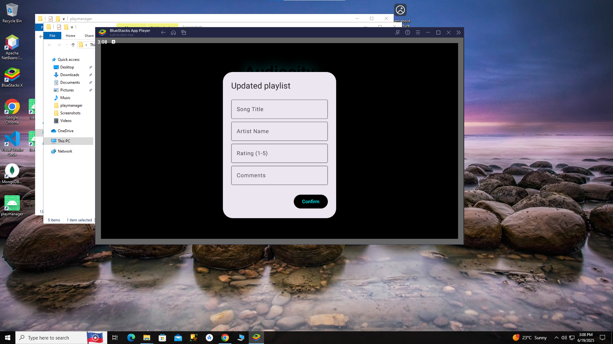
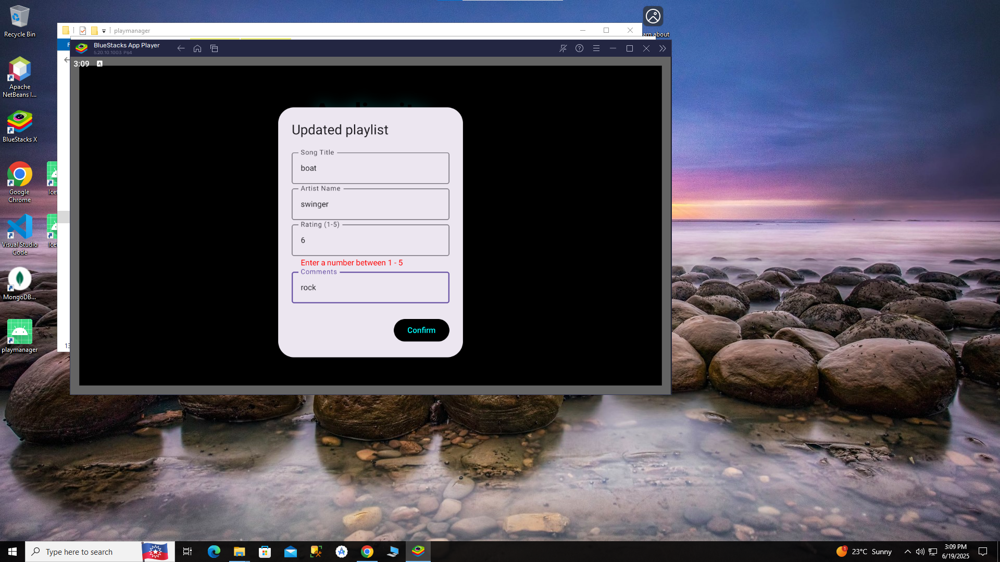
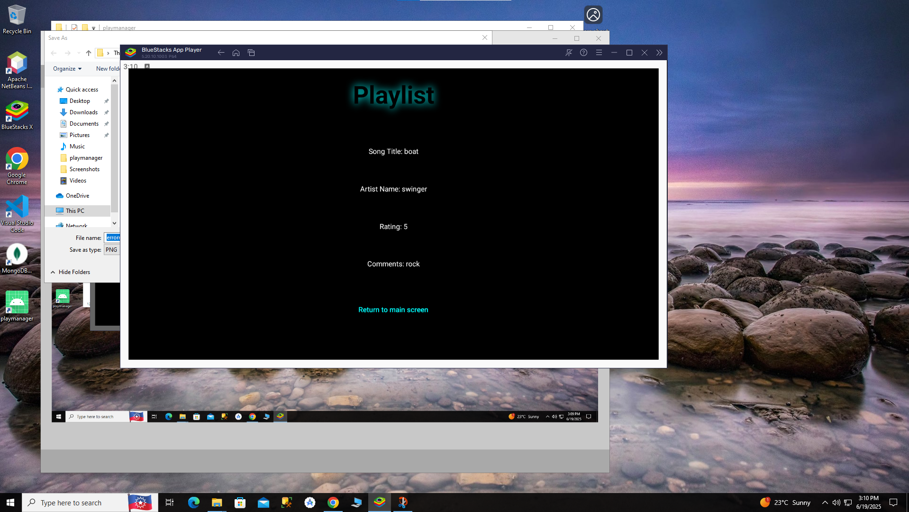

<!--
HOW TO USE:
This is an example of how you may give instructions on setting up your project locally.

Modify this file to match your project and remove sections that don't apply.

REQUIRED SECTIONS:
- Table of Contents
- About the Project
  - Built With
- Getting Started
- Author
- Future Features
- License

OPTIONAL SECTIONS:
- FAQ

After you're finished please remove all the comments and instructions!
-->

<h2><b>Audiocity</b></h2>

<!-- TABLE OF CONTENTS -->

# 📗 Table of Contents

- [📖 About the Project](#about-project)
    - [🛠 Built With](#built-with)
        - [Tech Stack](#tech-stack)
        - [Key Features](#key-features)
- [💻 Getting Started](#getting-started)
    - [Setup](#setup)
    - [Prerequisites](#prerequisites)
    - [Install](#install)
    - [Usage](#usage)
- [👥 Author](#author)
- [🔭 Future Features](#future-features)
- [📝 License](#license)

<!-- PROJECT DESCRIPTION -->

# 📖 [Audiocity] 

**[Audiocity]** A Kotlin based app called "Audiocity" used to create a playlist where a user can rate and comment on a song by a certain artist and later view the comments and ratings

**[Source code 1]**

This is images of my source code

**[Source code 2]**

This is images of my source code

**[Source code 3]**

This is images of my source code

**[Home Screen]**

This is the home screen which you start on and you have 3 options to choose from "add to playlist", "view playlist", or "exit"

**[Add play list]**

When clicking "add to playlist" it takes you to this modal which takes in the users inputs

**[Error handling]**

When the user inputs a value greater than 5 the error appears and displays the message for the user

**[View Screen]**

Finally when you click on confirm in the modal you can click on "view playlist" and go to the next screen and view the playlist with the ratings and comments

## 🛠 Built With <a name="built-with">Android studio and BlueStack 5</a>

### Tech Stack <a name="tech-stack">Kotlin</a>

  
Client

  <ul>
    <li><a href="https://developer.android.com/">Kotlin</a></li>
  </ul>

<!-- GETTING STARTED -->

## 💻 Getting Started 

To get a local copy up and running, follow these steps.

### Prerequisites

In order to run this project you need:

- A Desktop or Laptop Computer running on with Windows, Mac OS or Linux operating system.
- ANDROID STUDIO
- GitHub account
- BLUESTACK 5

> Clone this repository link for the Kotlin app [KOTLIN] https://github.com/shuhad786/Audiocity.git

### Setup

- Install Android Studio
- Create a Github account
- Install Bluestacks 5

### Usage

- Start up BlueStacks 5
- Start up Android Studio after bluestacks is fully loaded
- Copy the repository to your android studio

<!-- AUTHOR -->

## 👥 Author 

👤 **Shuhad Loofer**

- GitHub: [@shuhad786](https://github.com/shuhad786)

(<a href="#readme-top">back to top</a>)

<!-- LICENSE -->
